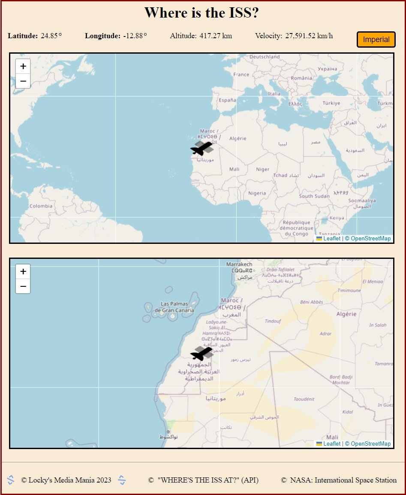
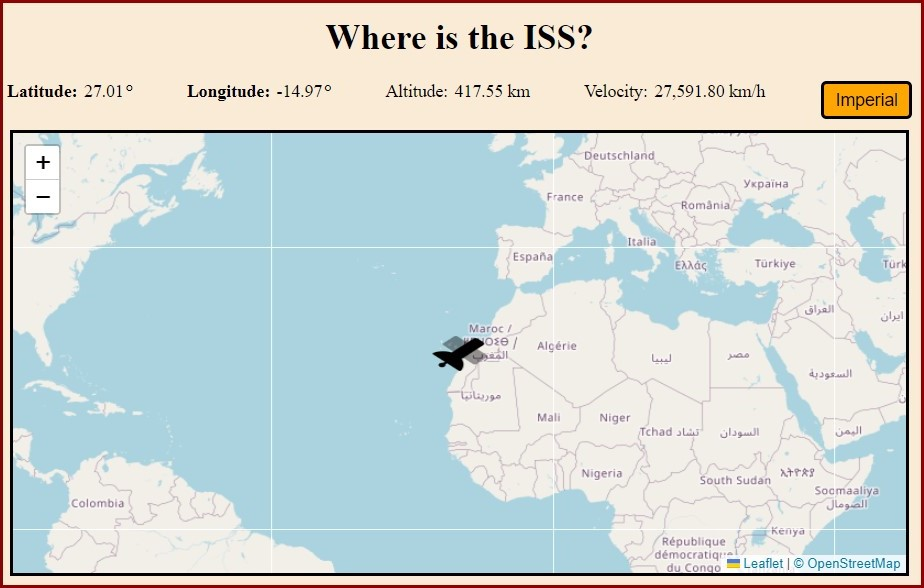
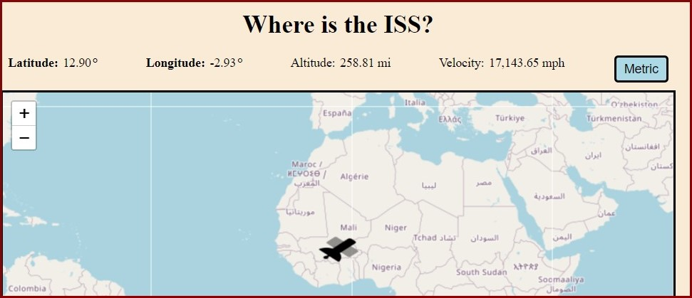

# ISS Locator

## User Story & Description:

- Develop an interactive web application from scratch using a wide array of standard web developer programs and third-party programs.

- Track the current location of the <a href="https://spotthestation.nasa.gov/tracking_map.cfm" target="_blank"><u>International Space Station (ISS)</u></a> in real-time. Real-time updates include Latitude, Longitude, Altitude and Velocity. User may watch and follow the trajectory of the ISS with interactive maps. The maps keep the ISS at the center of them while providing fully-functioning zoom in-and-out capabilities. Toggle-button allows the user to briefly switch between Metric and Imperial measurement methods.

- The web application runs several applications in the browser with dynamic updates. Application include HTML, CSS, Javascript, and third-party APIs. The web application is mobile-friendly too.
  - APIs include:
    - <a href="https://wheretheiss.at/" target="_blank">© <u>"WHERE THE ISS AT?"</u></a>
    - <a href="https://leafletjs.com/" target="_blank">© <u>Leaflet</u></a>
    - <a href="https://www.openstreetmap.org/#map=5/38.007/-95.844" target="_blank">© <u>OpenStreetMap </u></a>
    - <a href="https://fontawesome.com/" target="_blank">© <u>Font Awesome </u></a>

## Final Product

  

  
  

## Developer's Submitted Work:

- URL of the <u>deployed application</u>: <a href="https://clochstampfor60.github.io/iss-locator/" target="_blank" rel="noopener noreferrer">ISS Locator</a>

- Developer's GitHub Repository <a href="https://github.com/CLochstampfor60?tab=repositories" target="_blank" rel="noopener noreferrer"><u>CLocky60</u></a>

## Future Adjustments & Developments:

- Adjust the toggle-measurement button to remain fixed/'sticky' within the measurement conversion while the ISS location is dynamically updates using set the setIntervall() function. Currently the measurement 'sticks' to the browser for the entire setInterval(). When the time-elapses (currently 2 seconds), the Javascript resets and runs again anew defaulting to the metric measurement method.

- Adjust the boldness of the Altitude and Velocity words at the top of the page (matching the Latitude and Longitutde styling).
- Font Awesome style: to enable this while protecting the API key, will need to move this web app to server.

- Once the above changes are complete, refractor and remove remaining unncessary commented sections and code from index.html and script.js.

## License

- This project is licensed under the terms of the MIT license.

- This project is for developer use only.

---
